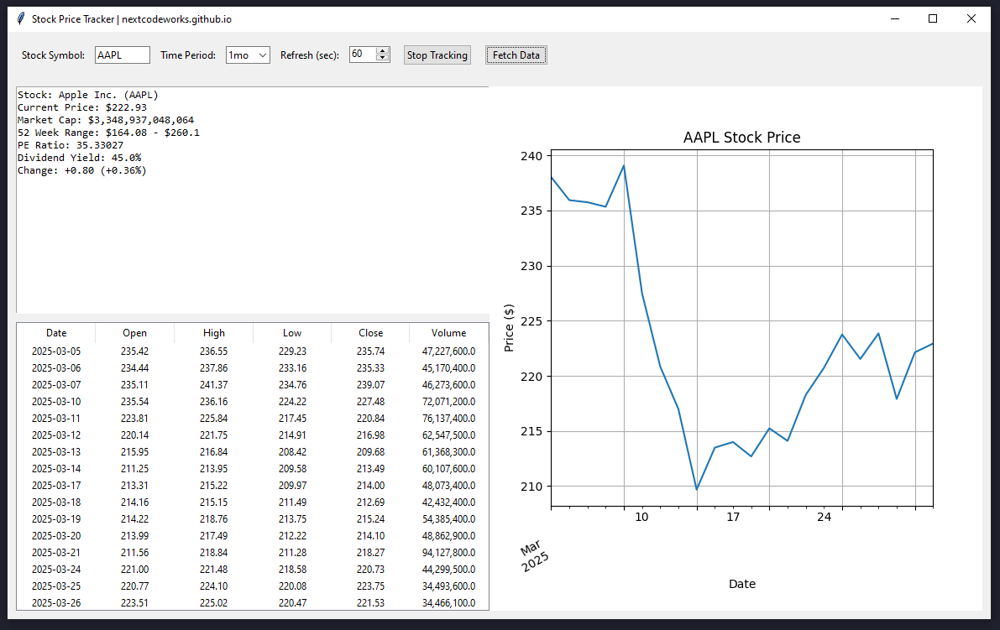

## 📌 Overview
A Python application that tracks stock prices in real-time using Yahoo Finance data, featuring a Tkinter GUI with interactive charts, historical data tables, and key financial metrics.



## ✨ Features
- **Real-time stock data** from Yahoo Finance (no API key required)
- **Interactive GUI** with Tkinter
- **Price charts** using Matplotlib
- **Historical data table** showing Open, High, Low, Close, and Volume
- **Key metrics** display including:
  - Current price and change percentage
  - Market capitalization
  - 52-week range
  - P/E ratio
  - Dividend yield
- **Auto-refresh** functionality with configurable interval
- **Multiple time periods** (1d, 5d, 1mo, 3mo, 6mo, 1y)

## 🛠️ Installation
1. Ensure you have Python 3.8+ installed
2. Install required packages:
   ```bash
   pip install -r requirements.txt
   ```

## 🚀 Usage
Run the application:
```bash
python stock_tracker.py
```

### Interface Controls:
1. **Stock Symbol**: Enter any valid stock ticker (e.g., AAPL, MSFT, TSLA)
2. **Time Period**: Select from 1 day to 1 year of historical data
3. **Refresh Interval**: Set auto-refresh time in seconds (10-3600)
4. **Start Tracking**: Enable auto-refresh of data
5. **Fetch Data**: Manually refresh current data

## ⚙️ Technical Details
- Uses `yfinance` library for stock data
- Implements multithreading for background updates
- Features responsive GUI design
- Includes error handling for invalid symbols

## 📜 License
MIT License - Free for personal and commercial use

## 🤝 Contributing
Contributions are welcome! Please open an issue or pull request for any improvements.

---

*Note: This program is for educational purposes only. Not financial advice.*
